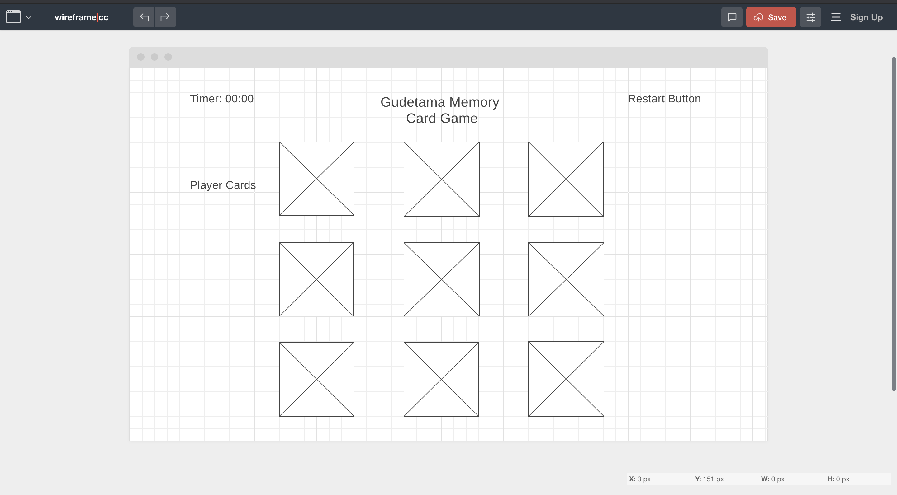

# Gudetama-Memory-Card-Game

## Back story
Wireframe

Our first project for GA SEI course was to make a game. I chose to make a memory card game because I used to love these as a kid.. 
<em>still love them as an adult too!

<em>Gudetama is a character created in Japan. The Japanese phrase "gude gude" which means "lazy" and "tama" which is short for 
the Japanese word "tamago" meaning egg, combines Gudetama to mean "lazy egg".

In 2017, Vox describes Gudetama as "a lazy egg yolk with a butt". 
Gudetama is a really fun character for all ages and that is another reason why I chose him for this project.

In the background of this game you can hear the children from his show say "gudetama!" when you get a match. I also included 
a relaxing version of the Gudetama theme song for players who are eager to listen while they play.

Above is my wireframe that has the basic outline of my first thoughts in creating this game. I added a few more cards to keep 
it interesting.
Methods used for this project were dom manipulation and semantic markup for HTML and CSS. Seperate files were used for HTML, JS
and CSS. To play this game either click the url or make sure that all files are linked for ease.
The technology that was used to create this project was Visual Studio Code for the coding and wireframe.cc to create the wireframe.
I did not include a timer or restart button for this game. The only problem I had was creating a pop-up for "you win!"

## User Stories/Game Logic
- The user will click the cards to flip them and reveal the other side of the cards face
- The cards will flip face down if they are not a match and stay flipped if they are a match
- User will attempt to flip all cards face up before the timer runs out
- If all cards are revealed, you win!

### Created by ©
Camille Bailey